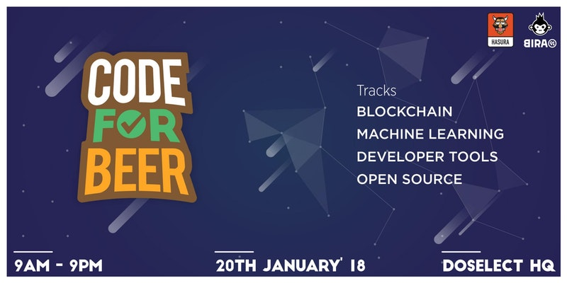

# Visual Question Answering

Based on the [VQA challenge](http://www.visualqa.org/) and [paper](http://arxiv.org/pdf/1505.00468v6.pdf), this is just a simple implementation of a pretrained model on a flask server.

online demo: [Hasura](https://app.debris23.hasura-app.io/) ( can only run images below 1Mb due to server limits )

**Note: This is a python 2 program**

This is the code hosted in [Hasura](https://hasura.io). switch to [local](https://github.com/radonys/CFB-VQA/tree/local) branch for installation and new code.

# Credits
This code and weights are based on [@anantzoid](https://github.com/anantzoid)'s VQA [code](https://github.com/anantzoid/VQA-Keras-Visual-Question-Answering).
